# javascript-react-complejo

## Tools versions

node version: 12.18.4 - 14.15.4
npm version: 6.14.6 - 6.14.11
react create version: create-react-app@3.4.1
bootstrap: 4.5.2
Bootstrap is dependent on jQuery and Popper, 


This project was bootstrapped with [Create React App](https://github.com/facebook/create-react-app).

## Pre requisites

1. Windows 10 (64-bit).
2. Resolution of monitor 1080p (24 inches recommended).
3. Google chrome Version 86.0 (64-bit).
4. Browser zoom recommended 100%.

## Deploy 🚀

### Install dependencies npm

```
npm install
```

### MOCK DATA
1. configure: .env
```
REACT_APP_MOCK_DATA = TRUE
REACT_APP_BACKEND_HOST = 'Your local host'
```

### API 
1. API https://github.com/10micky10/java-spring-complejo
2. configure: .env
```
REACT_APP_MOCK_DATA = FALSE
REACT_APP_BACKEND_HOST = 'Your local host'
```

In the project directory, you can run:

### Start
1. Start App
```
npm start
```
2. Enter with
```
username: admin
password: admin123
```

Runs the app in the development mode.<br />
Open [http://localhost:3000](http://localhost:3000) to view it in the browser.

The page will reload if you make edits.<br />
You will also see any lint errors in the console.

## Documenation

### Documenation tables - react-bootstrap
https://react-bootstrap-table.github.io/react-bootstrap-table2/storybook/index.html

### Use Case Diagram

<p align="center">
  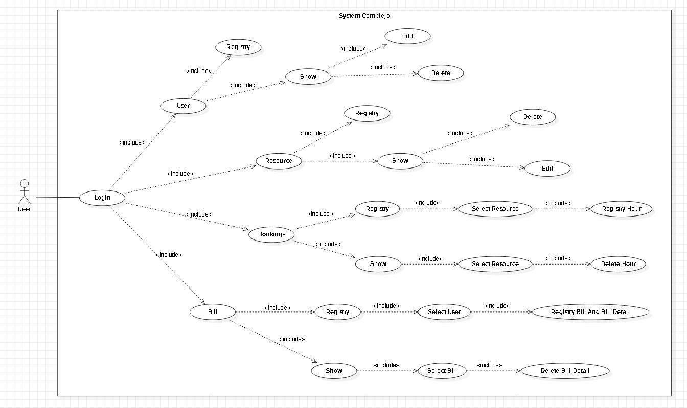
</p>

### LogIn

<p align="center">
  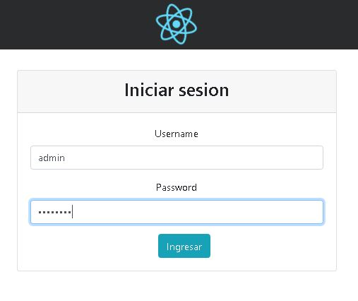
</p>

### Registry User

<p align="center">
  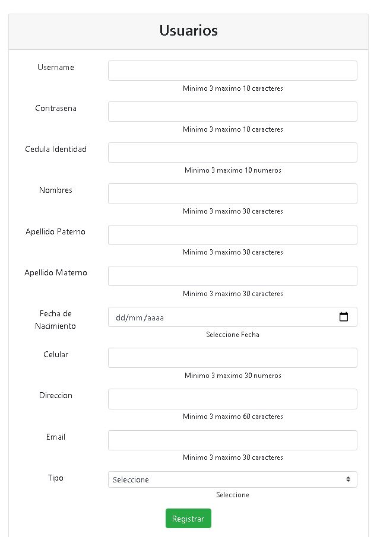
</p>

### Show User

<p align="center">
  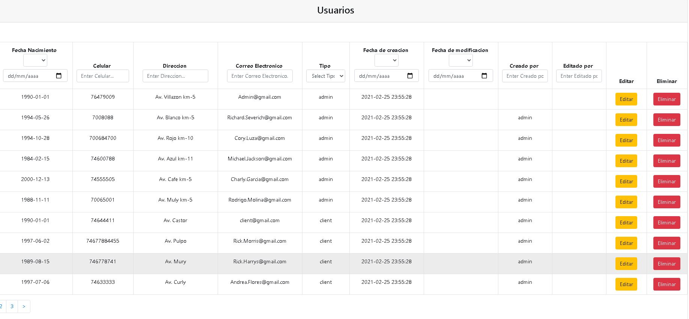
</p>

### Registry Resource

<p align="center">
  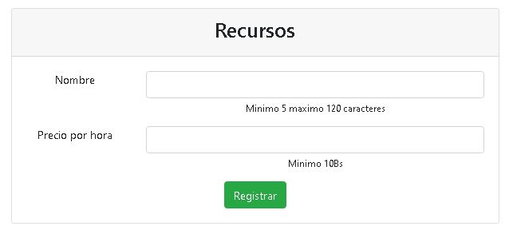
</p>

### Show Resource

<p align="center">
  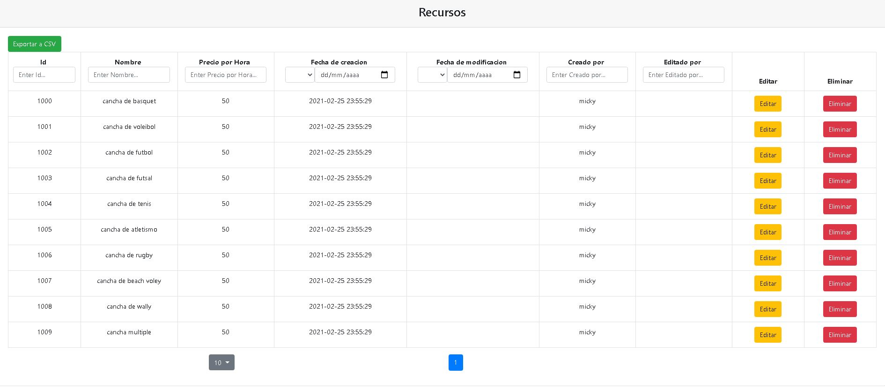
</p>

### Registry Booking

#### Select Resource

<p align="center">
  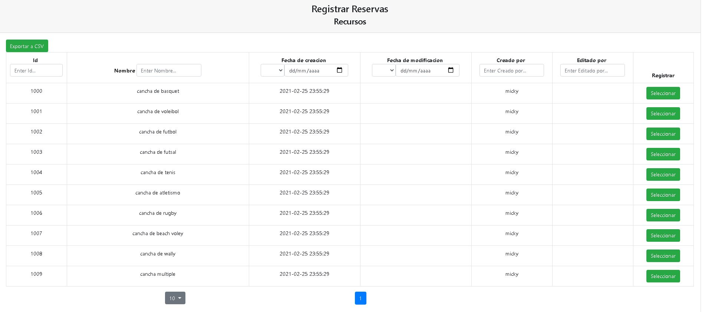
</p>

#### Select Date

<p align="center">
  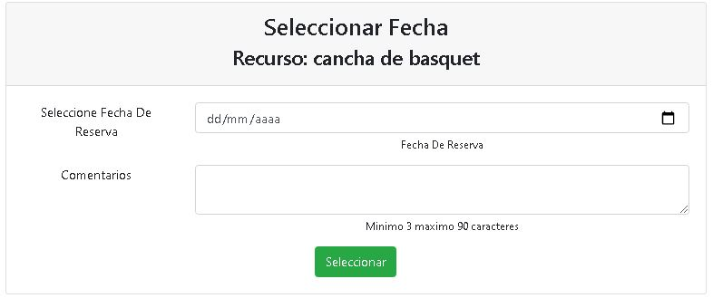
</p>

#### Select Date

<p align="center">
  
</p>

#### Registry Hours

<p align="center">
  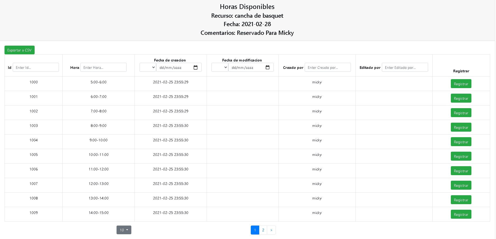
</p>

### Show Booking

#### Select Resource

<p align="center">
  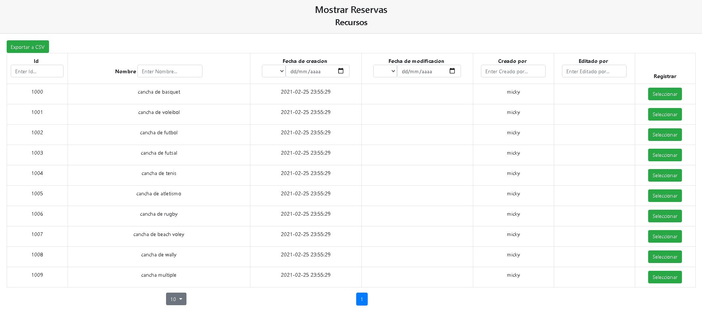
</p>

#### Select Date

<p align="center">
  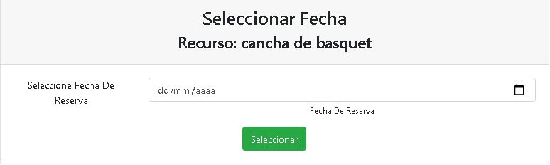
</p>

#### Delete Hours

<p align="center">
  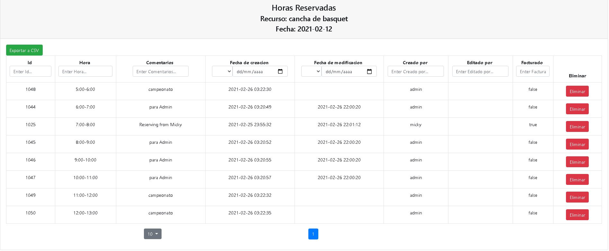
</p>

### Registry Bill

#### Select Booking Date

<p align="center">
  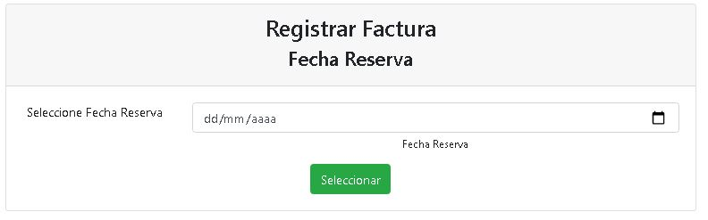
</p>

#### Select User

<p align="center">
  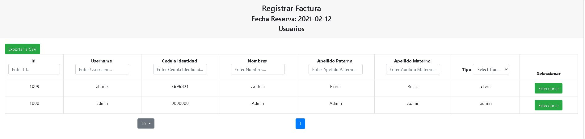
</p>

#### Registry Bill And Detail

<p align="center">
  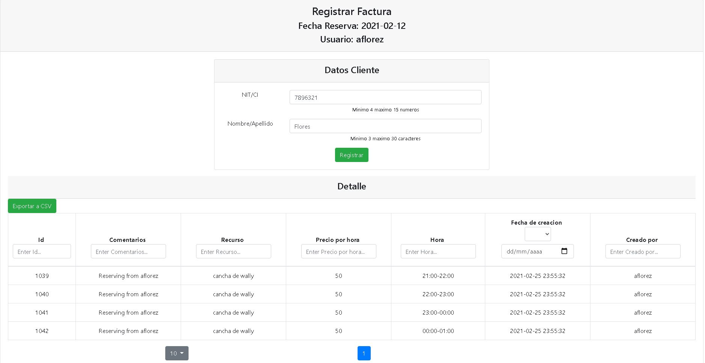
</p>

### Show Bill

#### Select Bill Date

<p align="center">
  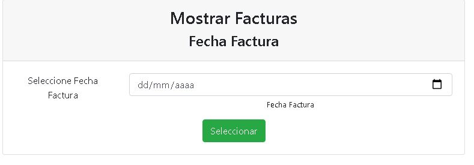
</p>

#### Select Bill

<p align="center">
  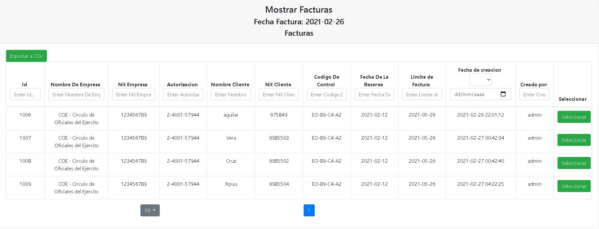
</p>

#### Delete Detail

<p align="center">
  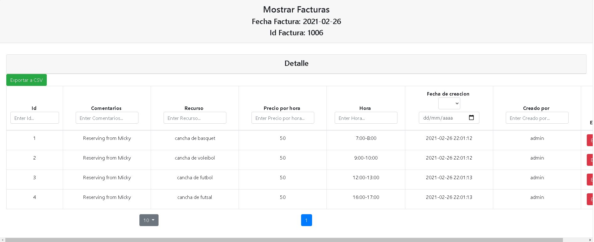
</p>

## Contributing

1. Fork it!
2. Create your feature branch: `git checkout -b feature/1001`
3. Commit your changes: `git commit -m 'feature/1001: Add some feature'`
4. Push to the branch: `git push origin feature/1001`
5. Submit a pull request.

## License

- Free.
